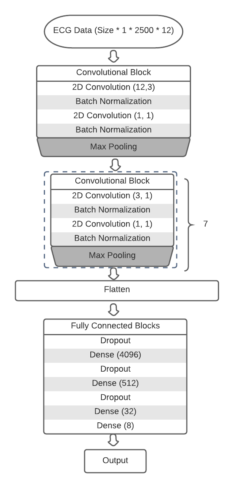

# 2D CNN Model
  We constructed a 2D convolutional model for this task. We take the data of shape (<batch_size>, 1, 2500, 12) as the input of the model. The code file 2D_CNN.ipynb contains the preprocessing code for the data we used. If a new set of data is used, please preprocess the input ECG data to this desired shape.
  
## Data Preprocessing
  
  The following data preprocessing methods are included in the code itself:
  1. truncate_data(source_array, target_array): Exclude outliers in target array using mean and std of the source array, and could be used within each lead of ECG.
  2. normalize_array(x, y): normalize the array y using mean and std of array x.
  3. truncate_data_median(source_array, target_array): Similar to the first function, but using median and mad to make the process robust to large outliers.
  4. normalization_with_limits_median(source_array, target_array): same as function 2 but using median and mad.
  
  Please make sure both train and test data are in the shape of (<batch_size>, 1, 2500, 12) before continuing. Now the preprocessed data are passed into the 6th block in the file to create the data loader. 
  
## The Model  
  The model we constructed contains total of 8 convolutional blocks. The first convolutional block with 2 convolutional layers, 2 batch normalization layers and a maxpooling layer. Notice that the kernel size of the first layer is (12, 3), which indicates that we analyze 3 of the 12 leads at a time. After this block, there are 7 nearly identical convolutional blocks with 2 convolutional layers and 2 batch normalization layers. While some slightly difference in size of maxpooling, all blocks are the same and the main construction of the model is shown below. The actual kernel sizes and hyperparameter choices can be found in the code itself in 2D_CNN.ipynb.
  
  
  
To train and evaluate this model, run all the cells from cell 6 and below. You can adjust the parameters including learning rate, regularization factor in block 21 where the optimizer_ft is specified. Notice that we used a learning rate scheduler in block 21. If this scheduler is not desired or other decay rate is specified, change the gamma rate inside the learning rate scheduler. 

## Model Evaluation
Use the plot(history) method to visulize the training and validationg accuracy, loss and validation AUC, depending on the metric used.

Now this model achieves a validation set accuracy of 0.83 and an AUC of 0.84 on the amyloid pace removed data in the data file. If higher performance of this model is desired, tune the model through the hyperparameter tuning scheme provided in this repository. 
