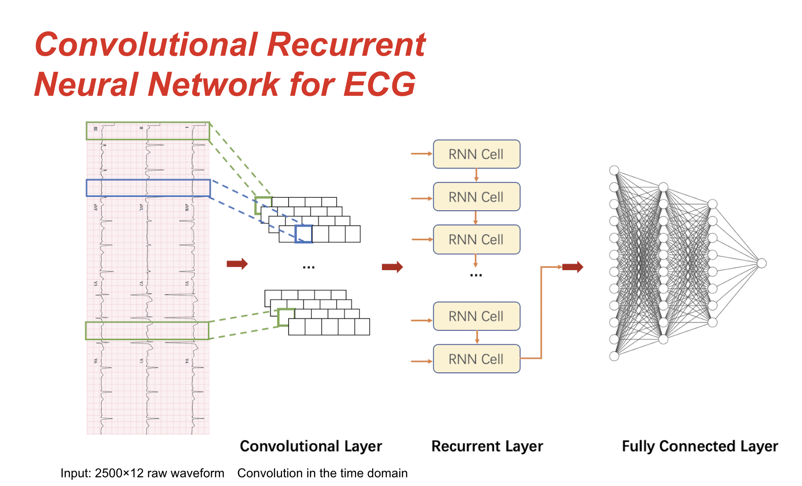

# Convolutional Recurrent Neural Network (CRNN) Model
  We constructed a CRNN model for this task. The model processes raw data using CNNs, and then feed its output to RNNs, forming a Convolutional Recurrent Neural Network (CRNN). In such case, convolutional layers extract local features, and recurrent layers combine it to extract temporal features. We take the original data which contains 2500 time steps and 12 leads (<batch_size>, 1, 2500, 12) as the input of the model. 
  
  

Use the plot(history) method to visulize the training and validationg accuracy, loss and validation AUC, depending on the metric used.

Now this model achieves AUC ROC of 0.86 on the validation set on the amyloid pace removed data in the data file. If higher performance of this model is desired, tune the model through the hyperparameter tuning scheme provided in this repository. 

Another advantage of this model is that this model is relatively shallow and very efficient as well. Currently, the number of parameters of the CRNN model we implemented is around 500,000, which is much lower than the 2D CNN model. This model is not resource-intensive and time-consuming.

