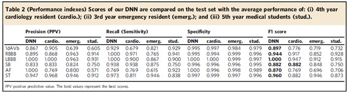

# autoECG
Model and transfer learning model based on Automatic diagnosis of the 12-lead ECG using a deep neural network, Ribeiro, et al.
# 1. Background
  We tried to build an advanced model according to the paper Automatic diagnosis of the 12-lead ECG using a deep neural network. This paper uses CNN and RNN models to do
the classification. The dataset in the original paper is very similar to what we have. The original data, acquired from the Telehealth Network of Minas Gerais (TNMG) [1]
, also contains 12 leads. With each lead, the duration of the ECG recording is between 7s to 10s, with frequency ranging from 300 HZ to 600 HZ. To make input of the same size, the data was zero-padded and each lead has 4096 numbers. The dataset size is very large, containing 2,322,513 ECG records from 1,676,384 patients. The training set contains 98% of the data and the validation set contains 2% of the data.
In the paper, the DNN architecture is structured as follows:  

   

  The network consists of a convolutional layer followed by four residual blocks with two convolutional layers per block. Max Pooling and 1*1 convolutional network are included in the skip connections to make the dimensions match those output from the main branch. The output of the last layer was then fed into a fully connected dense layer with sigmoid
activation function. The result in this paper is attractive. The minimum F1 score achieved is 0.8970 (for 1dAVb) and the maximum F1 score is 1.00 (for LBBB). For all types of disease, the DNN prediction accuracy outperforms humans.  

  

# 2. Modified Structure
  The original model consists of four residual blocks and the overall structure is shown in the following graph. The output has six entries, each containing a probability between 0 and 1, and can be understood as the probability of a given abnormality to be present. The abnormalities are not mutually exclusive, so the probabilities do not necessarily sum to one.  
  While in our cases, we only need to determine a certain ECG data whether is normal or abnormal (the two probabilities sum to one), so our new output should be a single probability. Therefore, we modified the final dense layer by changing the unit number from six to one while still using the ‘sigmoid’ activation function. Moreover, we used the binary cross entropy function as the new loss function.
  We also apply keras tuner package to tune the hyperprameters in the modified model. 
  The coding file of the modified model and hyperparameter tuning is in the autoecg_model_gpu.py file under the root directory. Note that the data path in the .py file is a sudo path /data/Xtrain.npy. The sudo path should be changed accordingly. 

  
  
  
  
# 3. Data Generator
Each of our ECG data consists of 12 leads, with a duration of 10 seconds and a frequency of 250 Hz. Therefore, each sample is a data matrix of 12 by 2500. In our case, we worked on 2 sets
of data, one was synthetic, one was real clinical data. Although we cannot share our real clinical data, the simulation code is accessible. 

***3.1 Simulation Code***

The simlation part includes two files: **'ecg_simulation.py'** and **'parameters. py'**.

**Instruction**:
 - Install package **neurokit2**
 - Open **sample_code_for_simulation.ipynb** which is a short sample notebook to show the way to output synthetic data.
 - Function **simulation** is all you need.
    1.  Input:\
    **normal_N**: the number of normal ECG data;\
   **abnormal_N**: the number of abnormal ECG data;\
   **save_params**: whether save parameters for each ecg sample, default value is *False*.
    2. Output:\
        **sim_ecg_data.npy**: output file, `shape = (normal_N + abnormal_N, 12, sampling_rate*duration)`;\
        **sim_ecg_labels.npy**: output file to save labels, `shape = (normal_N + abnormal_N, )`;\
        **sim_ecg_params.npy**: depend on **save_params**, file to save parameters for each ecg sample, `shape = (normal_N + abnormal_N, )`.
The saved data is already **shuffled**.
 - If you want more customized ECG data, please check **parameters. py** file. All the parameters' definitions are in the following table (_1 stands for normal, _2 stands for abnormal):
 
|                |Parameter                           |Meaning                          |
|----------------|-------------------------------|-----------------------------|
|1|sampling_rate          |sampling rate, default 250 Hz          |
|2          |duration|default 10s|
 |3         |gamma|a (12,5) matrix to modify each lead's five spikes' amplitudes|
 |4          |mu_hr_1          |the mean of heart rate        |
|5          |sigma_hr_1          |the variance of heart rate        |
|6         |min_noise_1, max_noise_1        |the max value and min value of noise        |
|7|t           |the starting position along the circle of each interval in radius         |
|8          |a          |the amplitude of each spike; b, the width of each spike         |
|9          |b|the width of each spike|

For a better understanding of the above parameters, please read the following.
[]

 We can see from the above table that each interval in the 3D trajectory can be fixed by 3 parameters: the starting position 
 along the circle of each interval in radius, The amplitude of each spike a and the width of each wave b. By altering these 3 parameters we can change the shape of the 3D trajectory and thus change the waveform of the resulting ECG. 

***3.2 Preprocessing Code***

The input shape of the autoECG model should be 4096 by 12. To satisfy this requirement, the data need to be firstly padded with zeroes: from (12, 2500) to (12, 4096);  after being transposed, the data become (4096, 12). The preprocessing code is in **autoecg_model_gpu**  and the function's name is **preprocess**.
  

# 4. Transfer Learning
  Because the performance of the model was pretty good, and the training set used by the paper was super large, we assumed the original model learned enough information about how to diagnose an ECG, which suggested using transfer learning and fine-tuning would be a promising and practical step to take. We basically froze the first 5 layers making them untrainable and freed the rest layers’s weights (the pretrained model in total had 50 layers) and we built our own neural network followed by the 45th layer of the pretrained one. We added three 1d convolutional layers and three dense layers followed by the 45th layer. The structure can be viewed as follow:  
 
    
  
  The coding file of Transfer Learning is in the Transfer_Learning.py file under the root directory.

[1] Ribeiro, A.H., Ribeiro, M.H., Paixão, G.M.M. et al. Automatic diagnosis of the 12-lead
ECG using a deep neural network.
Nat Commun 11, 1760 (2020). https://doi.org/10.1038/s41467-020-15432-4
