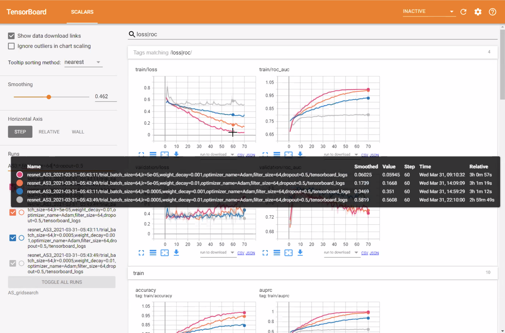

# Repository Contents

constants.py: File containing all the tuneable parameters and the current values to try

paths.py: File containing all the paths to the data files on the remote server

tuningfunctions.py: File containing functions used in example.ipynb

models.py: File containing the model class definitions to be tuned, tuneable parameters should be placed in constants.py and called when using trial.suggest

example.ipynb: Jupyter Notebook detailing the necessary steps to optimize hyperparameters in Ignite+Optuna, including loading data, defining the objective, running trials, and viewing the Tensorboard logs.

# Accessing Tensorboard Logs
-Ensure you have tensorboard installed (presuming you use Conda environments run the following)
'''
conda install -c conda-forge tensorboard
'''
-after successful install enter below...
'''
tensorboard --logdir <LOCATION OF TENSORBOARD DIRECTORY>
'''
-you should see "TensorBoard 1.15.0 at http://youraddress:6006/ (Press CTRL+C to quit)"  (NOTE that 6006 may be in use by other users)
-open a new terminal window and enter 
'''
  ssh youruserID@youraddress -- -NfL 6006:localhost:6006
'''
-open your local browser and type in ~~~localhost:6006~~~
  
# Example Tensorboard Log Output
The tensorboard will log all experiments and allow you to review the train and validation stages across them.

