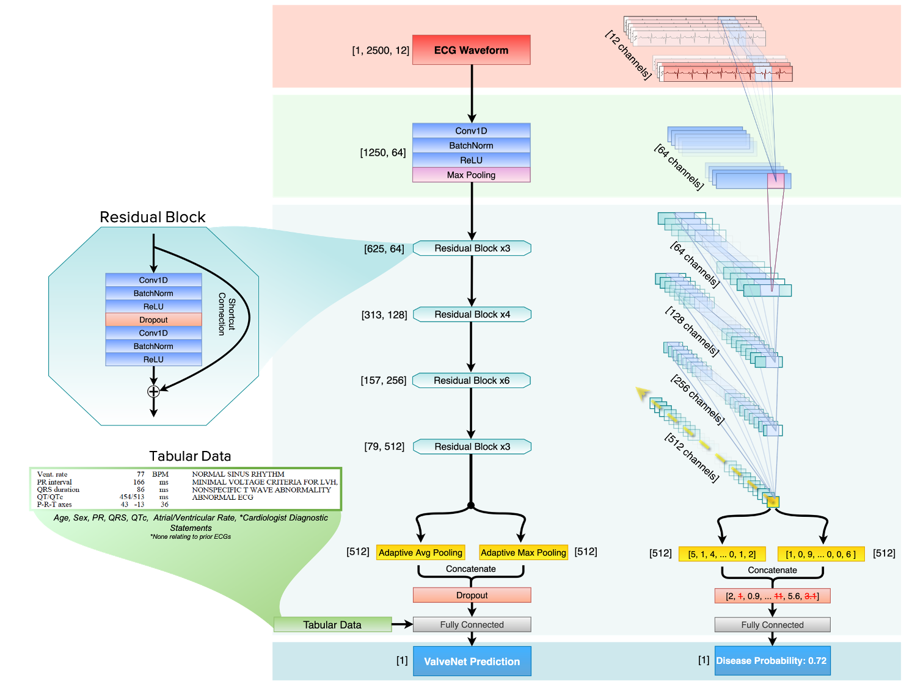

# IntroECG: A full-process library for deep learning on 12-lead electrocardiograms

This repository is meant to be a useful resource library for getting started with deep learning work using electrocardiograms.  

## 1-Waveform Extraction
Scripts and tutorial for extracting raw ECG waveforms from GE Muse or PDFs of ECGs. It also includes examples of how to display and review your ECG data. 

## 2-Generating Synthetic ECG Data
Generate your own synthetic electrocardiograms. Comes with the ability to alter many different aspects of the waveform to test different hypotheses.

## 3-Preprocessing
Key preprocessing steps for cleaning and normalizing ECG data. 

## 4-Models
Different example models we've built to showcase approaches that work for electrocardiograms, in pytorch and tensorflow/keras.

## 5-Training with Ignite and Optuna
A framework built on PyTorch Ignite using Optuna to allow for rapid experimentation and displaying your results using Tensorboard

## Development Team
Lead Developers: 
-Pierre Elias 
-Adler Perotte 

Contributors: 
-Vijay Rajaram 
-Shengqing Xia 
-Alex Wan 
-Junyang Jiang 
-Yuge Shen 
-Han Wang 
